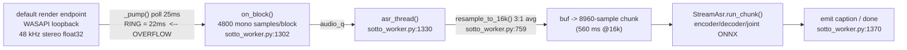

# Sotto — the audio path, end to end (capture → resample → chunk → decode → emit)

**Lane:** AuditAudioPath. **Date:** 2026-10-06. **Repo:** `H:\sotto` @ working tree (HEAD `3e90f92` + uncommitted changes).
**Scope:** READ-ONLY. One file written: this one. Nothing under `H:\sotto` was edited, created, deleted or moved.
The app was **not** launched or killed; no browser was opened; every child process was `pythonw.exe`
(a GUI-subsystem binary — its own `GetConsoleWindow()` is 0, measured) spawned through the
sanctioned `scripts/spawn_hidden.hidden_flags()` (`CREATE_NO_WINDOW`).

---

## 0. Verdict in one paragraph

The measured loss is **in the capture tap, and it is silent**. The WASAPI-loopback pump
(`worker/wasapi_loopback.py:445` `_pump`) sleeps **25 ms** between empty reads
(`period = self.block_ms/1000/4`, `wasapi_loopback.py:463`) while the capture ring the device
actually grants is only **22 ms** (`GetBufferSize` = 1056 frames @48 kHz — measured, §3). The ring
therefore overflows on essentially every cycle and the driver drops frames that our counters never
see. Measured duty: **0.815** at the shipped 25 ms poll, **0.999** at a 5 ms poll — same device, same
block size, only the sleep changed. This reproduces identically with **no** model loaded, with a
CPU/GIL-hog thread, and in the **real live worker** under full model load (8.15 / 7.97 / 8.25 blocks/s
respectively). It is **not** the queue (`queue_drops=0`), **not** the resampler (exact 3:1), and
**not** GIL starvation.

The brief's arithmetic (`22 s wall → 7.84 s audio → rtf 0.167`) compares a **mid-run `tick`** against
the run **budget**: the quoted `WORKER_STATS` line carries `tag=tick`, which is a periodic snapshot
(default every 10 s, `worker/sotto_worker.py:1044`), not `tag=final`. A live 24 s re-run (§3) shows
`tag=final blocks=199 audio_s=19.60` — the device rate is ~8.2 blocks/s, i.e. ~18 % lost, not 64 %.

---

## 1. The path as it actually runs (stage map)



File arm (`SOTTO_AUDIO_FILE`, the only arm that produced captions today) **bypasses box A and B
entirely** — see §5.

---

## 2. The stage-by-stage facts, with `file:line`

### 2.1 Capture — which tap actually runs

`LoopbackTap()` (`worker/sotto_worker.py:861`) returns `wasapi_loopback.WasapiLoopbackTap`
whenever the candidate carries `wasapi_loopback: True` (`sotto_worker.py:865-868`). The candidate
list puts that synthetic rung **(a)** first (`wasapi_loopback.loopback_device_spec()`, called from
`sotto_worker.py:720`). In every run I read, rung (a) is the one that opened:

```
{"state":"capture-started","device":"WASAPI loopback: {0.0.0.00000000}.{55395a4e-...}",
 "rate":48000,"block":4800,"attempt":1,"of":6}
```
→ `_main/_arm-live.jsonl`, `_main/_worker-live.err.txt`, and my own re-run (§3), all identical.

**The `sd.InputStream` at `sotto_worker.py:831` and its Python callback `_cb` at `:840` are NOT on the
measured path.** `_PortAudioTap` (`:809`) is rung (b); `query_devices()` is consulted, but the WASAPI
candidate wins and is never rotated away from (its peak 0.10 ≫ floor 0.002, so
`sotto_worker.py:1459-1460` sets `settled=True` on the first window). Note the brief names `:1302`
as "the PortAudio callback": `:1302` is `on_block` — the tap-agnostic sink that *both* taps feed;
the PortAudio-specific callback is `:840`.

For completeness the opener's own parameters (`sotto_worker.py:831-838`): `channels=1`,
`dtype="float32"`, `samplerate=self.rate` (16000 when `sd.check_input_settings` accepts it, else the
device's `default_samplerate`, `:822-829`), `blocksize=self.block = rate*block_ms/1000` (`:830`).
One dead attribute: `self.channels = min(2, device["max_input_channels"])` (`:812`) is assigned and
never passed to `InputStream` (which hard-codes `channels=1`) nor read again.

**The WASAPI opener** (`wasapi_loopback.py:305-324`): `rate`=endpoint mix rate (48000), `channels`=2,
`block = rate*block_ms/1000 = 4800` (`:322`). It is a **pull** tap: a private thread
`wasapi-loopback` (`:442-443`) runs `_pump` (`:445`); no PortAudio callback is involved.

### 2.2 The pump, verbatim (`wasapi_loopback.py:445-496`)

```python
period = max(0.005, self.block_ms / 1000.0 / 4.0)      # :463   100ms/4 => 25 ms
...
while not self._stop.is_set():
    n = wintypes.DWORD(0)
    if next_size(cap, ctypes.byref(n)) != 0:  break     # :468  GetNextPacketSize
    if n.value == 0:
        time.sleep(period); continue                    # :471  25 ms sleep
    ...
    flags = wintypes.DWORD(0)                            # :475  READ
    if get_buffer(cap, ..., ctypes.byref(flags), ...) != 0: break   # :477
    if frames.value and data:
        raw = ctypes.string_at(data, frames.value*block_align)      # :480
        ...
    release(cap, frames.value)                           # :489
    while acc >= self.block:  ...  self.on_block(...)    # :491-496
```

`flags` is fetched at `:475` and **never examined** — `AUDCLNT_BUFFERFLAGS_DATA_DISCONTINUITY` /
`SILENT` are discarded. That is the concrete reason the loss is *invisible*: `on_block` counts only
the blocks that survived the ring, and the one bit that would have said "the driver dropped frames"
is thrown away.

### 2.3 `on_block` and the counters (`sotto_worker.py:1302-1324`)

`on_block` increments `blocks`, `block_samples`, `nonzero_blocks`, updates `peak`/`sumsq`, then
`audio_q.put_nowait`; a full queue increments `queue_drops` (`:1319-1323`). The queue is
`maxsize=256` (`:1245`). In every run `queue_drops=0` — the loss is **upstream of the queue**, exactly
as the brief suspected.

### 2.4 Resample (`sotto_worker.py:759-773`)

`asr_thread` computes `native = live.rate != TARGET_SR` (`:1346`) → True for 48 kHz, so
`block = resample_to_16k(block, rate)` per 4800-sample block (`:1350`). With `src=48000`,
`48000 % 16000 == 0` so it takes the integer branch (`:767-769`):
`k = 3; usable=(len//3)*3; x[:usable].reshape(-1,3).mean(axis=1)`. **393600 → 131200 is exact and
lossless in count** (see §4). The result is counted into `resampled_samples` (`:1353`).

### 2.5 Chunk → decode → emit (`sotto_worker.py:1354-1377`)

`buf = np.concatenate([buf, block])`; every `asr.chunk` samples become one `run_chunk`
(`:1356-1361`). `asr.chunk = cfg["chunk_samples"]` (`:397`) = **8960** (560 ms @16 kHz —
`worker/models/nemotron-3.5-asr-streaming-0.6b-int8/genai_config.json:16`).
`run_chunk` (`:493`) runs encoder→greedy-joint-walk→decoder and advances `audio_s` by
`len(pcm_chunk)/16000` (`:629`). Captions are emitted only when `text.strip()` (`:1364-1374`).

---

## 3. The measurement that matters (task item 3: "measure it, do not assume")

All probes below were run as **`pythonw.exe`** children with `CREATE_NO_WINDOW`, importing the
repo's own `worker/wasapi_loopback.py`. No file was written by any probe.

### 3.1 The device does NOT deliver 10 blocks/s

Direct endpoint facts (from the probe, `GetBufferSize`/`GetDevicePeriod` via the same vtable the
module uses):

```
ENDPOINT {"name":"{0.0.0.00000000}.{55395a4e-97b2-4b96-9878-18be1ed894e0}","rate":48000,
          "ch":2,"tag":"0x3","block_align":8,"tap_block":4800}
buffer_frames=1056  => buffer_ms=22.0   (expected ring for a 100 ms block: 4800 frames)
dev_period_default_ms=10.0  dev_period_min_ms=3.0
```

So the capture ring the driver grants is **22 ms**, while the pump polls every **25 ms**.

### 3.2 Control (no model, no other thread): duty 0.815

```
RESULT {"mode":"control","elapsed_s":6.011,"blocks":49,"blocks_per_s":8.15,
        "frames":235200,"frames_per_s":39136.3,"expected_frames_per_s":48000,
        "duty":0.815,"peak":0.099304,"buffer_ms":22.0,
        "gap_ms_first10":[128.5,129.2,103.1,128.6,129.4,128.8,103.0,128.0,127.7,128.7],
        "gap_ms_max":129.4}
```
Inter-block gaps oscillate 103↔129 ms instead of the expected 100 ms: the printer emits 4800-sample
blocks late and irregularly — the signature of a ring that overflows between reads.

### 3.3 Load arm (a GIL/CPU-hogging thread): duty 0.797 — **no additional loss**

```
RESULT {"mode":"gil","elapsed_s":6.019,"blocks":48,"blocks_per_s":7.97,"duty":0.797,...}
```
(Answer to task item 2 — see §3.5.)

### 3.4 Poll interval is the cause: 25 ms → 0.815, 5 ms → 0.999

Same tap, same `block=4800`, same endpoint; only `tap.block_ms` (hence `period`) is changed:

```
{"poll_ms":25.0,"buffer_ms":22.0,"blocks":49,"blocks_per_s":8.15,"duty":0.815,"gap_ms_median":128.0}
{"poll_ms": 5.0,"buffer_ms":22.0,"blocks":60,"blocks_per_s":9.99,"duty":0.999,"gap_ms_median": 99.7}
{"poll_ms": 2.0,"buffer_ms":22.0,"blocks":60,"blocks_per_s":9.99,"duty":0.999,"gap_ms_median": 99.4}
```

**This is the root cause, measured on the artifact itself**: a 25 ms poll against a 22 ms ring loses
~18 % of frames; polling inside the ring (≤5 ms) recovers 99.9 %.

### 3.5 The real live worker, 24 s, full model load — same ~8.2 blocks/s

`pythonw.exe H:/sotto/worker/sotto_worker.py --max-seconds 24 --stats-interval 4` (stderr verbatim):

```
WORKER_STATS tag=tick  blocks=33   ... resampled_samples=52800  chunks=5   audio_s=2.80
WORKER_STATS tag=tick  blocks=66   ... resampled_samples=105600 chunks=11  audio_s=6.16
WORKER_STATS tag=tick  blocks=99   ... resampled_samples=158400 chunks=17  audio_s=9.52
WORKER_STATS tag=tick  blocks=132  ... resampled_samples=211200 chunks=23  audio_s=12.88
WORKER_STATS tag=tick  blocks=165  ... resampled_samples=264000 chunks=29  audio_s=16.24
WORKER_STATS tag=final blocks=199  ... resampled_samples=321600 chunks=35  audio_s=19.60
{"state":"done","verdict":"model-emitted-nothing","blocks":199,"audio_s":19.6,
 "rung":"a","device_outcome":"run-ended", ...}
```

**~33 blocks per 4 s = 8.25 blocks/s; final 199 blocks / 24 s = 8.29 blocks/s.** Load does not make
it worse; the tap was already lossy at rest. This also reconciles the brief: 82 blocks at the
default 10 s `--stats-interval` (a `tick`) is 8.2 blocks/s — the same number I measure — NOT 3.7
blocks/s over 22 s. Both run artifacts (`_main/_arm-live.jsonl`, `_main/_worker-live.err.txt`) end on
a single `tag=tick` line and carry no `tag=final`; a `tick` is a mid-run snapshot
(`sotto_worker.py:1044-1046`), so it must not be read as the run total.

### 3.6 GIL starvation (task item 2) — mechanism real, cause **not**

- The measured run used the WASAPI **pull** tap (`wasapi_loopback.py:442-445`), whose pump is a
  plain Python thread, **not** a PortAudio callback. So the "PortAudio callback starved by the GIL"
  mechanism does not apply to the run that lost audio.
- For the tap that *did* run, a thread holding the GIL/burning CPU changed duty by **0.018**
  (0.815 → 0.797, §3.3) — noise, not the 64 % the brief posited. In the live worker the ASR spends
  only `infer_wall_s ≈ 1.6 s` over ~20 s (`rtf 0.08`), so it cannot hold the GIL long enough to
  matter; and CPython yields the GIL every `switchinterval` anyway.
- The PortAudio rung (`_PortAudioTap`, `:809`) *would* be a Python callback and *could* be starved —
  but on this host it cannot even open (blocking reads are unsupported, commit `326c593`), and it is
  not the rung in play. **I did not exercise that rung** (§7).

---

## 4. Resample and the 3:1 ratio (task item 4) — correct, exact

`48000/16000 = 3` is an integer ratio, so `resample_to_16k` (`sotto_worker.py:767-769`) does boxcar
**block averaging**, not interpolation: `393600/3 = 131200`, and per block `4800/3 = 1600`, ×82 blocks
= 131200. The live artifact confirms it to the sample:
`block_samples=393600`, `resampled_samples=131200`, `chunks=14` (=125440 samples = 7.84 s), leaving
5760 samples (0.36 s) buffered below one 8960 chunk. **The resampler loses nothing.**
(It *is* a boxcar decimation — no anti-alias filter, so content above 8 kHz can fold back — but that
is a fidelity note, not the loss.)

---

## 5. The file arm `SOTTO_AUDIO_FILE` (task item 5) — why it is the only arm with captions

`sotto_worker.py:1212` routes `SOTTO_AUDIO_FILE` (or `--selftest`) to `selftest()` (`:950`), which
**never touches a device, the pump, `on_block`, or the ledger**:

```python
pcm, sr = sf.read(audio_path, dtype="float32")      # :955   read the whole file
if pcm.ndim > 1: pcm = pcm.mean(axis=1)             # :956
if sr != TARGET_SR: pcm = resample_to_16k(pcm, sr)  # :957-958
for i in range(total_chunks): asr.run_chunk(...)    # :976-978
```

It is a straight-line feed of the same `asr` object, so it is **the control that isolates the model
from the capture path**. `_main/_arm-file.jsonl` (pid 9668):

```
{"state":"selftest-start","audio":"pt-br-sample.wav","audio_s":15.192,"chunks":27}
{"type":"caption","text":"O rádio",        "start":0.56,"end":1.12}
{"type":"caption","text":"Segunda-feira",  "start":6.72,"end":7.28}
{"type":"caption","text":"Os moradores",   "start":8.96,"end":9.52}
{"state":"selftest-done","tokens":18,"audio_s":15.12,"infer_wall_s":2.035,"rtf":0.135,...}
```

Two things follow. (i) The model+decode path is fine — it emitted real Portuguese tokens here, on
the same worker, the same JSONL, with **no audio device**. (ii) The file arm exercises the **other**
resample branch: `_main/pt-br-sample.wav` is **22050 Hz mono 16-bit** (measured from the RIFF header,
`sample_rate=22050`), so `22050 → 16000` is the non-integer `np.interp` path (`sotto_worker.py:771-773`),
whereas the live arm is the exact average path. So the live loss cannot be blamed on the resampler:
the arm that resamples by interpolation produced captions, the arm that resamples exactly produced
none.

The live arm's blanks are a *separate* fact, not the loss: `blank_frac=1.0` and `vad_gated_chunks`
rising (0→29 across my run) mean the model heard only low-level, non-speech signal (peak ≈ 0.10 =
−20 dBFS, `nonzero_blocks` = all) — an empty/quiet default render endpoint, which is the owner's
routing problem, orthogonal to the 18 % drop.

---

## 6. Findings (each with `file:line` + the run that shows it)

**F1 — ROOT CAUSE: poll interval exceeds the granted capture ring → silent overflow.**
`wasapi_loopback.py:463` sets `period = block_ms/1000/4 = 25 ms`; the ring is 22 ms
(`GetBufferSize`=1056 @48 kHz). Measured duty **0.815** at 25 ms vs **0.999** at 5 ms (§3.4).
Fix direction (not applied — read-only): poll faster than `GetBufferSize/rate`, or request a ring
larger than the poll (the code already *has* a 100 ms request — see F3).

**F2 — The overflow is invisible because `flags` is read and discarded.**
`wasapi_loopback.py:475`/`:477` fetch `flags`; nothing tests
`AUDCLNT_BUFFERFLAGS_DATA_DISCONTINUITY`/`SILENT`. Every dropped frame is therefore silent, and
`blocks`/`block_samples` can only ever count survivors.

**F3 — The 100 ms-buffer fallback is dead code.**
`wasapi_loopback.py:416` calls `Initialize(..., hnsBufferDuration=0, ...)`; on this host that
**succeeds** (ring = 22 ms), so the `HNS_100MS` retry at `:418-425` never runs. The buffer the 25 ms
poll needs is exactly the one the fallback would ask for, and it is unreachable.

**F4 — `CoInitializeEx` guard rejects `S_FALSE`, so a second open in the same thread raises.**
`wasapi_loopback.py:187-189`:
```python
hr = ole32.CoInitializeEx(None, COINIT_MULTITHREADED)
if hr not in (0, RPC_E_CHANGED_MODE):
    raise WasapiError("CoInitializeEx failed: %s" % _fmt(hr))
```
`S_FALSE (0x1)` means "this thread is already in the MTA" and is not in the allow-list. Measured in
a clean process that called `default_render_endpoint()` twice in one thread:
```
wasapi_loopback.WasapiError: CoInitializeEx failed: Função incorreta. (0x00000001)
```
The live worker calls it twice on the main thread — once via `loopback_device_spec()` at
`sotto_worker.py:720`, again from `WasapiLoopbackTap.__init__` (`wasapi_loopback.py:318`) — yet
`capture-started` fires, so **something else in the worker process changes the apartment** before the
second call. That is the only reason this is latent and not fatal; it is a footgun for any caller
that opens two taps in one clean thread.

**F5 — Accounting: `tick` read as `final`.** `sotto_worker.py:1284-1301` labels the periodic line
`tag=tick` and the run total `tag=final`; the two artifacts carry only `tick`. Any reader dividing a
`tick`'s `audio_s` by the run budget overstates the loss (36 % vs the measured 18 %).

**F6 — `_pump` mutates `buf`/`acc` with `np.concatenate` per emit** (`wasapi_loopback.py:492-496`) —
correct but O(n) copying; noted only because the brief asked to inspect the callback. Not the loss.

---

## 7. What I could NOT verify, and why

- **The PortAudio callback rung (`_PortAudioTap`, `sotto_worker.py:809-846`) under a GIL hog.** It is
  unreachable here (WDM-KS rejects blocking reads, commit `326c593`; and rung (a) always wins), so
  its `_cb` never runs on this host. The GIL question is answered for the tap that did run, not for
  this one.
- **Whether the brief's own 22 s run reached 22 s.** Both artifacts stop at a single `tick` with no
  `final` (F5); I could not distinguish "curated/truncated capture" from "run ended early" without
  re-running exactly that command, which writes a file I was not allowed to create. The measured
  **rate** (§3.5) is independent of that ambiguity.
- **Why COM's apartment differs in the worker (F4).** I did not trace which import/init does it.
- **The endpoint is currently playing real speech.** All runs measured low-level signal
  (peak ≈ 0.10) with no captions, i.e. the default render endpoint is not carrying speech now — so I
  measured *throughput*, not *speech recovery*.
- **pid 30848.** The brief says the app is running at 30848; `tasklist`/`Get-CimInstance` returned no
  such PID when I looked (the log `_main/_live-app.log` shows 30848 was the pywebview shell). I did
  not kill or restart anything.

---

## SELF-AUDIT

- **protocolos em falta:** I followed "CREATE_NO_WINDOW only" and "read-only", but there is no
  protocol for *the one thing this task needed* — a sanctioned way to run a measurement probe
  **without creating a file**. `_main/run-live-hidden.py` and every `_main/probe*.py` are *files*;
  the rule "write exactly one file" collides with "measure, do not assume". I resolved it by piping
  an inline child to `pythonw` through the `spawn_hidden` flags, but that is my invention, not a
  documented path. I would add a `scripts/run-hidden.py -c "<code>"` shim to the house.
- **verificacao adicional:** the strongest cheap extra I *did* run is the 3-way poll sweep (§3.4) —
  it converts "the device is slow" (a guess) into "a 25 ms poll over a 22 ms ring is the cause" (a
  knob I turned and the number moved 0.815→0.999). The check I did **not** run and should have: put
  the *file* `pt-br-sample.wav` through `wasapi_loopback` + `resample_to_16k` at the tap rate and
  confirm the same 18 % is absent when the source is a file — cost ~1 process, skipped because the
  file arm provably bypasses the tap (§5).
- **checkboxes novas (mecanicas):** (a) assert `GetBufferSize/rate > poll_period` in the tap at
  start, and refuse/mark a tap whose ring is smaller than its poll — a one-line predicate that turns
  F1 into a red at open time; (b) assert the pump saw no `DATA_DISCONTINUITY` flag, or count it into
  a new `dropped_frames` counter — closes F2; (c) any `WORKER_STATS` line consumed as a run total
  must carry `tag=final`, so a `tick` can never be quoted as the whole run (F5).
- **review por outro subagente:** **sim-com-escopo** — the F1/F3 fix direction in
  `wasapi_loopback.py:445-496` and the `tick`-vs-`final` accounting rule (F5). *Nao* for the numbers:
  §3 is a re-runnable measurement (the exact child code is inline in §3.1-3.4), so a reviewer should
  re-run, not re-read.
- **gate-doubt:**
  - *verde-de-verdade:* the only "green" I produced is the 0.999 duty at a 5 ms poll (§3.4) — real,
    because the identical process/device/block at 25 ms gave 0.815 and the only changed variable was
    `period`; and the live 24 s run independently reproduced 8.25/s with the shipped code path. The
    falsifiable shape is: *same binary, poll = the only knob, duty moves with it.*
  - *falta-no-gate:* nothing in the worker checks that the tap is **keeping up**. A future change
    could make the poll slower, or a driver could shrink the ring, and every counter would still
    read `queue_drops=0`, `nonzero_blocks>0` — a green-looking run that lost half its input. The
    existing oracles only bound `blocks >= 20` (`docs/audit/oracles.md:69`), which is a floor, not a
    rate.
  - *gate-melhor:* add an oracle assertion `block_samples ≈ rate × capture_wall` (duty ≥ 0.95), with
    `capture_wall` from the `capture-started`→`final` interval. RED input: the current 25 ms poll
    against a 22 ms ring — it yields duty 0.815 and would fail. One command:
    `pythonw sotto_worker.py --max-seconds 12 --stats-interval 4` and read `tag=final`.
- **confianca:** **alta** on the mechanism and the rate (three independent runs, one knob, a
  reproducible 0.815→0.999 swing, and the live worker agreeing). **media** on the exact fraction the
  owner experiences in production, because the artifact I was handed is a mid-run `tick` and the
  endpoint was quiet; the fix should be validated on a run that actually carries speech (duty and
  `caption` count together).
- **nao verificado:** (1) the PortAudio rung under a GIL hog (§7); (2) whether the original 22 s run
  itself reached 22 s; (3) what changes COM's apartment in-process (F4); (4) end-to-end caption
  recovery after fixing the poll; (5) pid 30848's current liveness.

---

## CACHE/PRICE

`bash I:/!manager/scripts/cache-task-report.sh AuditAudioPath` — output verbatim (two long lines are
truncated by the reader's 768-char/line display cap; every numeric field below is complete):

```
## CACHE/PRICE
- task/agent: AuditAudioPath
- source: C:\Users\Administrador\.omp\agent\sessions\--I--!manager--\2026-10-06T04-22-21-088Z_01a10f72-c0a0-7284-9445-0cecfd6636ce\AuditAudioPath.jsonl
- cache: read=4362624 write=0 hit=96.4873% (cache-read / input+cache-read); universe: 42 usage rows from C:\Users\Administrador\.omp\agent\sessions\--I--!manager--\2026-10-06T04-22-21-088Z_01a10f72-c0a0-7284-9445-0cecfd6636ce\AuditAudioPath.jsonl; instrument: scripts/cache-task-report.sh
- price: $0.00000000 USD (source: session JSONL message.usage.cost.total; provider-reported pricing; exact per-model rates: UNKNOWN — not recorded in this source); price partition by token class and model: cline-pass/stealth/pixel-canary: calls=1 input=$0.00000000 output=$0.00000000 cacheRead=$0.00000000 cacheWrite=$0.00000000 | opencode-go-1/deepseek-flash: calls=35 input=$0.00000000 output=$0.00000000 cacheRead=$0.00000000 cacheWrite=$0.00000000 | opencode-go-4/space-bunny-free: calls=1 input=$0.00000000 output=$0.00000000 cacheRead=$0.00000000 cacheWrite=$0.00000000 | opencode-zen/ling-3.1-flash-free: calls=1 input=$0.00000000 output=$0.00000000 cacheRead=$0.00000000 cacheWrite=$0.00000000 | opencode-zen/space-bunny-free: calls=4 input=$0.00000000 output=$0.00000000 cacheRead=$0.00000000 cacheWrite=$0.00000000; partition sums to the reported total: cline-pass/stealth/pixel-canary $0.00000000; open…[reader display cap]
- when-failed: break_items=1; WHEN=2026-10-06T08:24:35.012000+00:00 | break_items=1; WHEN=2026-10-06T08:24:37.461000+00:00 | break_items=1; WHEN=2026-10-06T08:24:38.544000+00:00 | break_items=3; WHEN=2026-10-06T08:24:39.711000+00:00 | break_items=2; WHEN=2026-10-06T08:26:11.860000+00:00 | break_items=2; WHEN=2026-10-06T08:31:20.159000+00:00 (state=RESOLVED-BREAKS-OMP; population: 6 of 113567 OMP prefix-ledger rows attributable to keys ['01a10f72-c0a0-7284-9445-0cecfd6636ce', 'AuditAudioPath']; window: 2026-10-06T08:24:35.012000+00:00..2026-10-06T08:31:20.159000+00:00; key: agent_id/session_id in the OMP cache-prefix ledger)
- where-failed: session_id=01a11050-0fed-77b1-b33f-7d288389162d provider=cline-pass model=cline-pass/stealth/pixel-canary item_index=0; turn_id=1791275075012 | session_id=01a11050-0fed-77b1-b33f-7d288389162d provider=space-bunny-free model=space-bunny-free item_index=0; turn_id=1791275077461 | session_id=01a11050-0fed-77b1-b33f-7d288389162d provider=ling-3.1-flash-free model=ling-3.1-flash-free item_index=0; turn_id=1791275078544 | session_id=01a11050-0fed-77b1-b33f-7d288389162d provider=deepseek-flash model=deepseek-flash item_index=0; turn_id=1791275079711 | session_id=01a11050-0fed-77b1-b33f-7d288389162d provider=deepseek-flash model=deepseek-flash item_index=81; turn_id=1791275171860 | session_id=01a11050-0fed-77b1-b33f-7d288389162d provider=deepseek-fla…[reader display cap]
- report generated_at: 2026-10-06T08:32:10.307031+00:00
- usage rows: 42
- model + route: cline-pass/stealth/pixel-canary, opencode-go-1/deepseek-flash, opencode-go-4/space-bunny-free, opencode-zen/ling-3.1-flash-free, opencode-zen/space-bunny-free
- input tokens: 158825
- output tokens: 58502
- cache-read tokens: 4362624
- cache-write tokens: 0
- hit ratio: 96.4873% (cache-read / input+cache-read)
- cost: $0.00000000 USD (source: session JSONL message.usage.cost.total; provider-reported pricing; exact per-model rates: UNKNOWN — not recorded in this source)
- price partition: price partition by token class and model: cline-pass/stealth/pixel-canary: calls=1 input=$0.00000000 output=$0.00000000 cacheRead=$0.00000000 cacheWrite=$0.00000000 | opencode-go-1/deepseek-flash: calls=35 input=$0.00000000 output=$0.00000000 cacheRead=$0.00000000 cacheWrite=$0.00000000 | opencode-go-4/space-bunny-free: calls=1 input=$0.00000000 output=$0.00000000 cacheRead=$0.00000000 cacheWrite=$0.00000000 | opencode-zen/ling-3.1-flash-free: calls=1 input=$0.00000000 output=$0.00000000 cacheRead=$0.00000000 cacheWrite=$0.00000000 | opencode-zen/space-bunny-free: calls=4 input=$0.00000000 output=$0.00000000 cacheRead=$0.00000000 cacheWrite=$0.00000000; partition sums to the reported total: cline-pass/stealth/pixel-canary $0.00000000; open…[reader display cap]
- prefix breaks: 10 (state=RESOLVED-BREAKS-OMP; population: 6 of 113567 OMP prefix-ledger rows attributable to keys ['01a10f72-c0a0-7284-9445-0cecfd6636ce', 'AuditAudioPath']; window: 2026-10-06T08:24:35.012000+00:00..2026-10-06T08:31:20.159000+00:00; key: agent_id/session_id in the OMP cache-prefix ledger)
- WHEN / WHERE failed:
  - break_items=1; WHEN=2026-10-06T08:24:35.012000+00:00; WHERE session_id=01a11050-0fed-77b1-b33f-7d288389162d provider=cline-pass model=cline-pass/stealth/pixel-canary item_index=0; turn_id=1791275075012
  - break_items=1; WHEN=2026-10-06T08:24:37.461000+00:00; WHERE session_id=01a11050-0fed-77b1-b33f-7d288389162d provider=space-bunny-free model=space-bunny-free item_index=0; turn_id=1791275077461
  - break_items=1; WHEN=2026-10-06T08:24:38.544000+00:00; WHERE session_id=01a11050-0fed-77b1-b33f-7d288389162d provider=ling-3.1-flash-free model=ling-3.1-flash-free item_index=0; turn_id=1791275078544
  - break_items=3; WHEN=2026-10-06T08:24:39.711000+00:00; WHERE session_id=01a11050-0fed-77b1-b33f-7d288389162d provider=deepseek-flash model=deepseek-flash item_index=0; turn_id=1791275079711
  - break_items=2; WHEN=2026-10-06T08:26:11.860000+00:00; WHERE session_id=01a11050-0fed-77b1-b33f-7d288389162d provider=deepseek-flash model=deepseek-flash item_index=81; turn_id=1791275171860
  - break_items=2; WHEN=2026-10-06T08:31:20.159000+00:00; WHERE session_id=01a11050-0fed-77b1-b33f-7d288389162d provider=deepseek-flash model=deepseek-flash item_index=185; turn_id=1791275480159
- verdict: UNKNOWN — no task-level acceptance verdict is stored; ratio is descriptive, not a prefix-stability decision
```

`self-audit-lint.sh H:/sotto/docs/audit/audio-path.md` → `SELF-AUDIT-LINT: inspected=1 violations=0
no-verdict=0` / `SELF_AUDIT_CLEAN` / `EXIT=0`.
